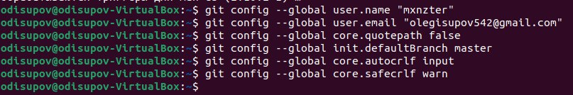
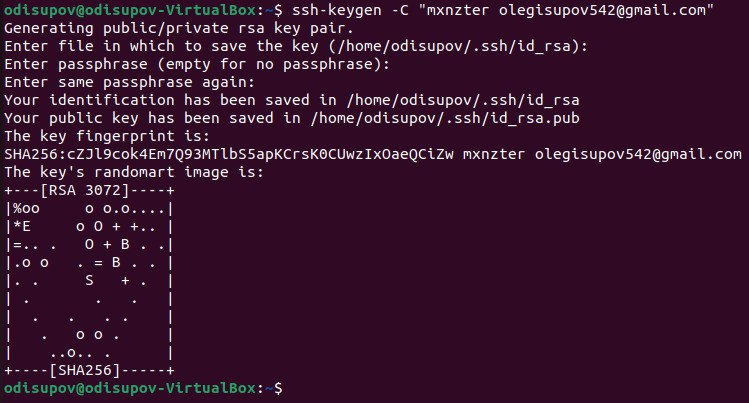
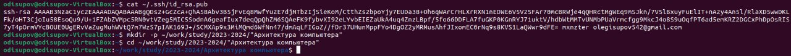
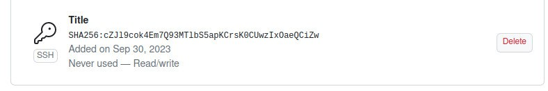
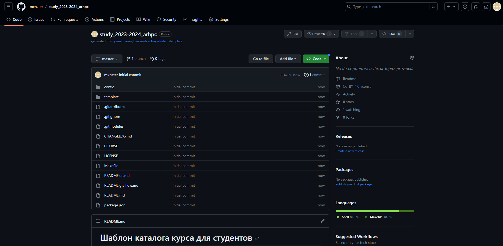
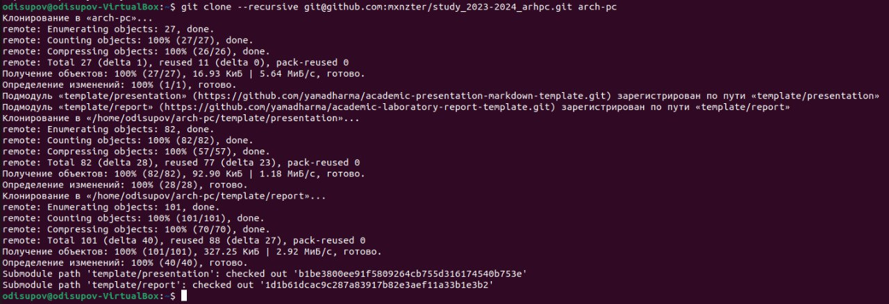
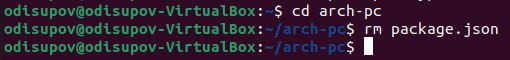
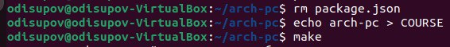
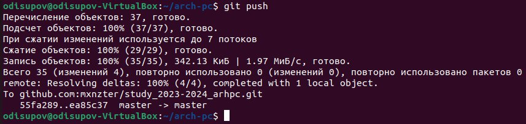
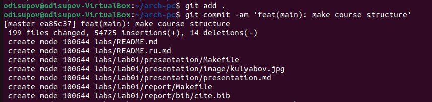

---
## Front matter
title: "Отчёт по лабораторной работе №2"
subtitle: "Система контроля версий GIT"
author: "Исупов Олег Денисович"

## Generic otions
lang: ru-RU
toc-title: "Содержание"

## Bibliography
bibliography: bib/cite.bib
csl: pandoc/csl/gost-r-7-0-5-2008-numeric.csl

## Pdf output format
toc: true # Table of contents
toc-depth: 2
lof: true # List of figures
lot: true # List of tables
fontsize: 12pt
linestretch: 1.5
papersize: a4
documentclass: scrreprt
## I18n polyglossia
polyglossia-lang:
  name: russian
  options:
	- spelling=modern
	- babelshorthands=true
polyglossia-otherlangs:
  name: english
## I18n babel
babel-lang: russian
babel-otherlangs: english
## Fonts
mainfont: PT Serif
romanfont: PT Serif
sansfont: PT Sans
monofont: PT Mono
mainfontoptions: Ligatures=TeX
romanfontoptions: Ligatures=TeX
sansfontoptions: Ligatures=TeX,Scale=MatchLowercase
monofontoptions: Scale=MatchLowercase,Scale=0.9
## Biblatex
biblatex: true
biblio-style: "gost-numeric"
biblatexoptions:
  - parentracker=true
  - backend=biber
  - hyperref=auto
  - language=auto
  - autolang=other*
  - citestyle=gost-numeric
## Pandoc-crossref LaTeX customization
figureTitle: "Рис."
tableTitle: "Таблица"
listingTitle: "Листинг"
lofTitle: "Список иллюстраций"
lotTitle: "Список таблиц"
lolTitle: "Листинги"
## Misc options
indent: true
header-includes:
  - \usepackage{indentfirst}
  - \usepackage{float} # keep figures where there are in the text
  - \floatplacement{figure}{H} # keep figures where there are in the text
---

# Цель работы

Целью работы является изучить идеологию и применение средств контроля версий. Приобрести практические навыки по работе с системой git.

# Выполнение лабораторной работы

Создание учетное записи на github.com

2.2 Базовая настройка git.
Создаем предварительную конфигурацию git.

2.3 Создание SSH-ключа.
Для последующей идентификации пользователя на сервере репозиториев необходимо сгенерировать пару ключей (приватный и публичный)

2.4 Создали ssh-ключ.

2.5 Создание рабочего пространства и репозитория курса на основе шаблона.
Откройте терминал и создайте каталог для предмета “Архитектура компьютера”

2.6 Создание репозитория курса на основе шаблона.
Репозиторий на основе шаблона можно создать через web-интерфейс github. Перейдем на страницу репозитория с шаблонами курса https://github.com/yamadharma/cour se-directory-student-template. Далее выберите use this template. В открывшемся окне задайте имя репозитория (Repository name) study_2023-2024_arhpc и создайте репозиторий (кнопка Create repository from template). Откройте терминал и перейдите в каталог курса.

2.7 Клонируем созданный репозиторий.

2.8 Настройка каталога курса.
Перейдем в каталог курса и удалим лишние файлы 

Создадим необходимые каталоги

2.9 Отправим файлы на сервер.

# Выводы

Таким образом мы научились создавать и базово настраивать репозитории на github.com по шаблонам представленным в примерах.

# Список литературы{.unnumbered}

