---
## Front matter
title: "Отчёт по лабораторной работе №9"
subtitle: "Понятие подпрограммы. Отладчик."
author: "Исупов Олег Денисович"

## Generic otions
lang: ru-RU
toc-title: "Содержание"

## Bibliography
bibliography: bib/cite.bib
csl: pandoc/csl/gost-r-7-0-5-2008-numeric.csl

## Pdf output format
toc: true # Table of contents
toc-depth: 2
lof: true # List of figures
lot: true # List of tables
fontsize: 12pt
linestretch: 1.5
papersize: a4
documentclass: scrreprt
## I18n polyglossia
polyglossia-lang:
  name: russian
  options:
	- spelling=modern
	- babelshorthands=true
polyglossia-otherlangs:
  name: english
## I18n babel
babel-lang: russian
babel-otherlangs: english
## Fonts
mainfont: PT Serif
romanfont: PT Serif
sansfont: PT Sans
monofont: PT Mono
mainfontoptions: Ligatures=TeX
romanfontoptions: Ligatures=TeX
sansfontoptions: Ligatures=TeX,Scale=MatchLowercase
monofontoptions: Scale=MatchLowercase,Scale=0.9
## Biblatex
biblatex: true
biblio-style: "gost-numeric"
biblatexoptions:
  - parentracker=true
  - backend=biber
  - hyperref=auto
  - language=auto
  - autolang=other*
  - citestyle=gost-numeric
## Pandoc-crossref LaTeX customization
figureTitle: "Рис."
tableTitle: "Таблица"
listingTitle: "Листинг"
lofTitle: "Список иллюстраций"
lotTitle: "Список таблиц"
lolTitle: "Листинги"
## Misc options
indent: true
header-includes:
  - \usepackage{indentfirst}
  - \usepackage{float} # keep figures where there are in the text
  - \floatplacement{figure}{H} # keep figures where there are in the text
---

# Цель работы

Приобретение навыков написания программ с использованием подпрограмм. Знакомство
с методами отладки при помощи GDB и его основными возможностями.

# Выполнение лабораторной работы

1. Создайте каталог для выполнения лабораторной работы № 9, перейдите в него и создайте файл lab09-1.asm

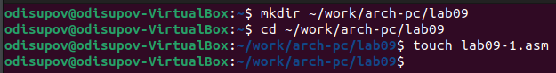

2. В качестве примера рассмотрим программу вычисления арифметического выражения
𝑓(𝑥) = 2𝑥 + 7 с помощью подпрограммы _calcul. В данном примере 𝑥 вводится с
клавиатуры, а само выражение вычисляется в подпрограмме.

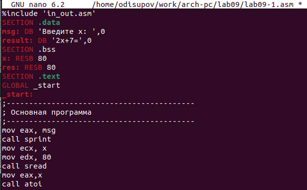

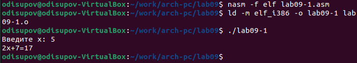

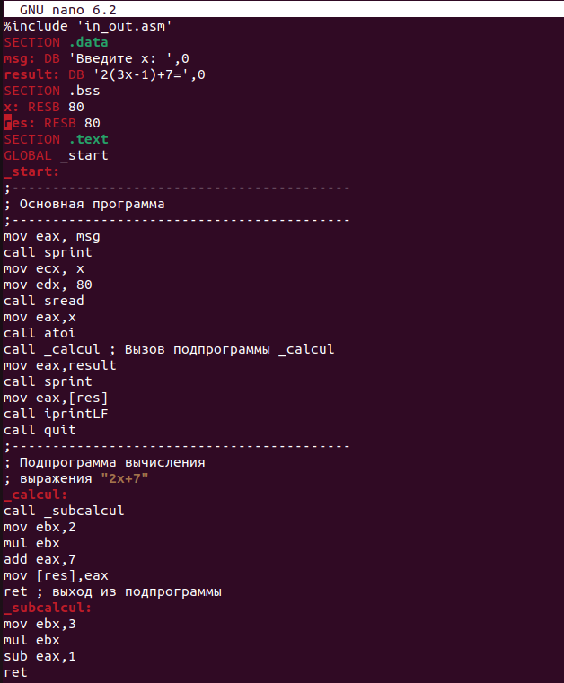

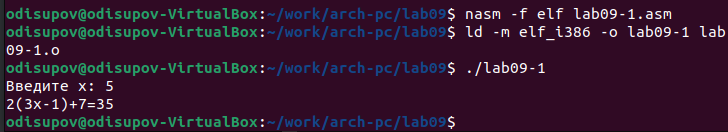

3. Создайте файл lab09-2.asm с текстом программы из Листинга 9.2

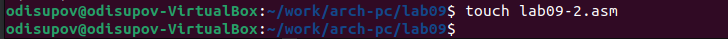

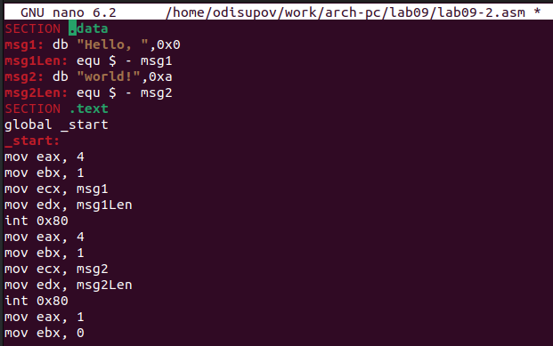

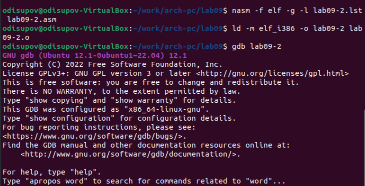

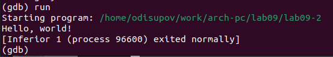

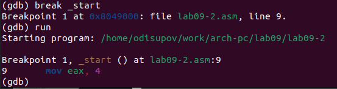

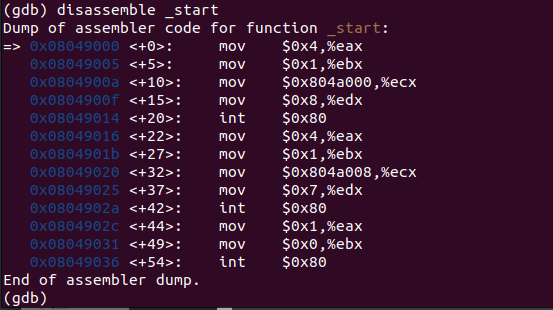

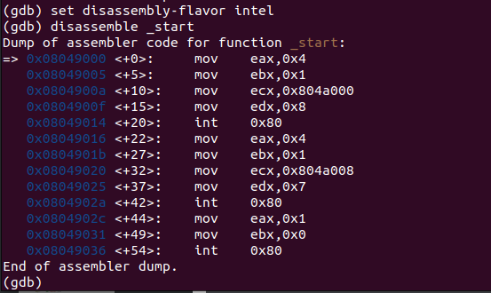

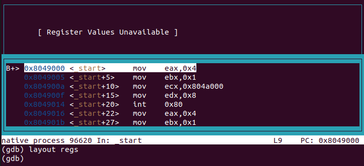

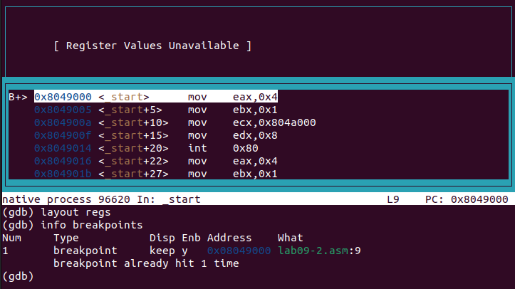

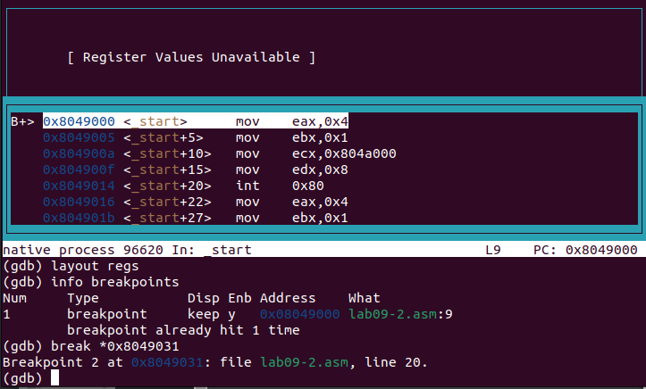

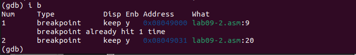

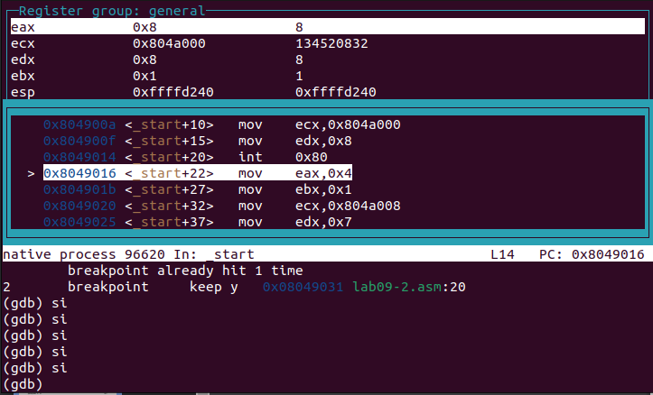

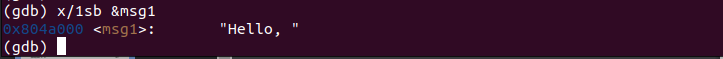

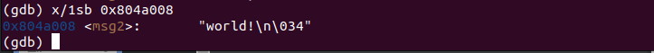

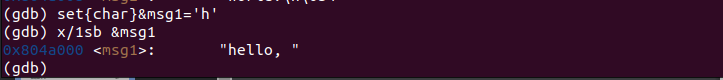

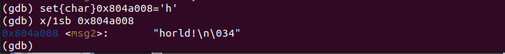

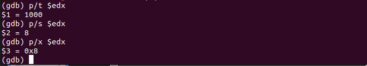

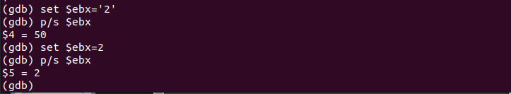

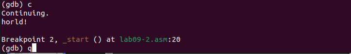

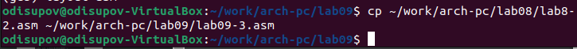

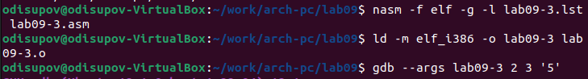

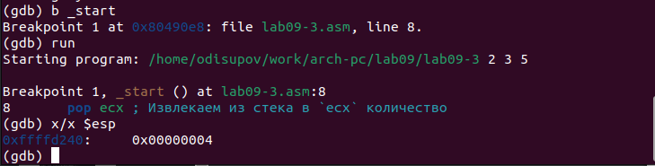

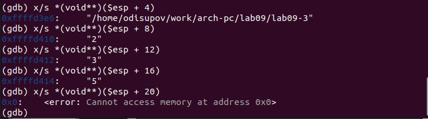

# Задания для самостоятельной работы

1. Преобразуйте программу из лабораторной работы №8, реализовав вычисление значения функции 𝑓(𝑥) как подпрограмму

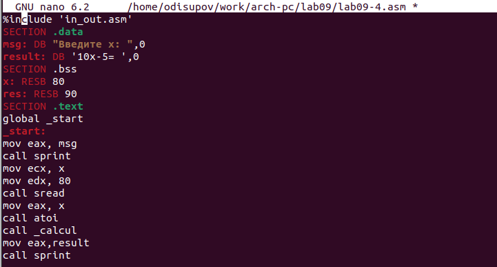

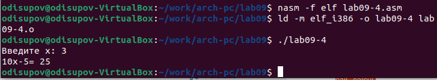

2. В листинге 9.3 приведена программа вычисления выражения (3 + 2) ∗ 4 + 5. При запуске
данная программа дает неверный результат. Проверьте это. С помощью отладчика GDB,
анализируя изменения значений регистров, определите ошибку и исправьте ее

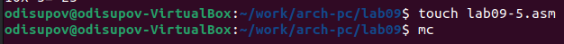

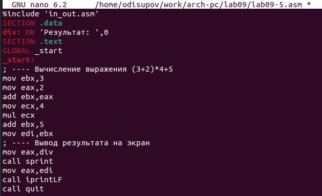

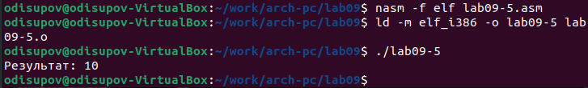

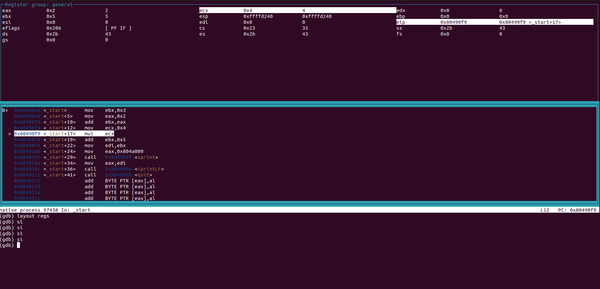

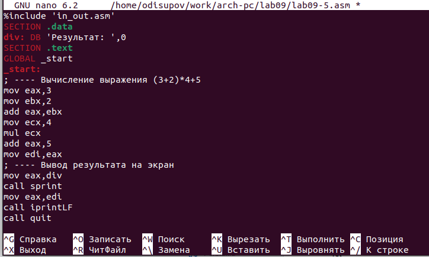

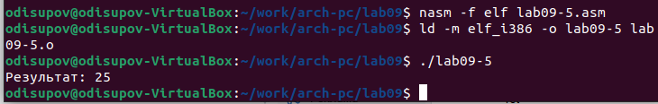

# Выводы

Я приобрёл навыки написания программ с использованием подпрограмм. Познакомился
с методами отладки при помощи GDB и его основными возможностями.

